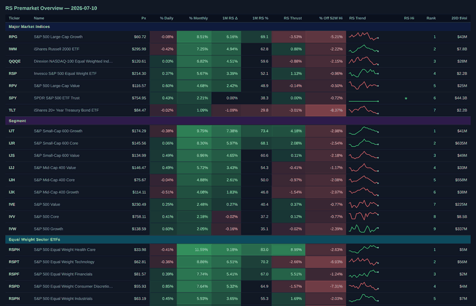

# RS ETF Premarket & Finviz Screeners

Two companion tools for a daily relative-strength / screener workflow:

- **`rs-premarket`** — builds a relative-strength "premarket overview" dashboard CSV across a
  broad universe of ETFs and stocks, measured against a benchmark (default: SPY)
- **`finviz_screeners`** — runs a set of saved Finviz Elite screener exports on a schedule and
  filters the resulting tickers by trailing weekly performance

They're independent (neither imports the other) but pair naturally: run the Finviz screeners
to source candidate lists, then use `rs-premarket` to rank relative strength across your own
universe, or vice versa.

**Prerequisites:** a paid **Finviz Elite** subscription (for the `export.ashx` screener URLs
and auth token) and a paid **Massive** (formerly Polygon.io) API subscription (for OHLCV/daily
bar data). Neither tool works on free-tier access to these services.



`visualize.py`'s HTML dashboard output — real ETF/sector data, heatmapped % columns and inline
RS trend sparklines. Static screenshot: [`docs/dashboard_screenshot.png`](docs/dashboard_screenshot.png).

> Looking for the Finviz screener output? Jump to the
> [full trend_confirmation_filter.py sample output](#full-sample-output-trend-confirmation-filter)
> at the bottom of this file, or see
> [`docs/trend_confirmation_filter_demo.md`](docs/trend_confirmation_filter_demo.md).

## Project layout

```text
rs-etf-premarket/
├── README.md
├── LICENSE
├── .env.example                                ← shared: POLYGON_API_KEY, FINVIZ_AUTH_TOKEN
├── pyproject.toml                              ← rs-premarket package
├── rs_premarket_csv.py                         ← thin shim to the rs-premarket entry point
├── visualize.py                                ← CSV → HTML dashboard renderer
├── rs_custom_universe_template.csv             ← minimal custom-universe example
├── premarket_overview_universe_template.csv    ← full default-style universe template
├── src/
│   └── rs_etf_premarket/
│       ├── __init__.py
│       └── cli.py       ← entry point, Polygon fetch, RS computation
└── finviz_screeners/
    ├── requirements.txt
    ├── screeners.yaml                    ← named Finviz Elite export URLs
    ├── run_screeners.py                  ← fetches each screener, saves dated CSVs + tickers.txt
    ├── weekly_range_filter.py            ← filters a day's tickers by trailing weekly performance
    └── trend_confirmation_filter.py      ← further filters those by 50/200 SMA trend + ATR distance
```

## Configuration

Copy `.env.example` to `.env` and fill in your keys — both tools read from the same root
`.env`:

```bash
cp .env.example .env
```

| Variable | Used by | Description |
|---|---|---|
| `POLYGON_API_KEY` | `rs-premarket` | Polygon.io API key for OHLCV and snapshot data (or pass `--polygon-key`) |
| `FINVIZ_AUTH_TOKEN` | `finviz_screeners` | Finviz Elite auth token (Account → API) |

---

## RS ETF Premarket

Builds a relative-strength "premarket overview" dashboard CSV across a broad universe of
ETFs and stocks — indices, size/style segments, equal-weight and SPDR sector ETFs, industry
groups, and a handful of individual names — all measured against a benchmark (default: SPY).

Pulls daily OHLCV data from [Polygon.io](https://polygon.io) for every ticker concurrently,
computes relative-strength deltas and thrust, and flags tickers with an improving RS trend as
"Setups." An included `visualize.py` script renders the CSV as a dark-themed HTML dashboard.

> **Note:** Polygon.io has rebranded to Massive. The `polygon-api-client` package,
> `POLYGON_API_KEY` env var, and API endpoints used here are unaffected as of this writing, but
> expect the SDK/branding to migrate over time.

### Features

- **Broad default universe**: indices, size/style segments, equal-weight sector ETFs, SPDR
  sector ETFs, dozens of industry-group ETFs, and select individual stocks
- Computes % daily / % monthly return, 1-month RS delta, RS thrust rate (short-term RS
  acceleration), % off 52-week high, and a compact text histogram of the trailing RS trend
- **Setup flag**: marks tickers where 1-month RS is improving and the stock isn't down hard
  today — an actionable relative-strength signal
- **`last_close` mode**: uses completed daily bars
- **`live` mode**: overlays a Polygon snapshot for the latest pre/post-market or intraday price
- Custom universe support via a `Section,Ticker,Name,Benchmark` CSV
- `visualize.py`: renders any output CSV as a styled, sectioned HTML dashboard

### Install

```bash
python -m venv .venv
source .venv/bin/activate
pip install -e .
```

Or with [uv](https://github.com/astral-sh/uv):

```bash
uv sync
```

### Usage

**Default universe:**

```bash
rs-premarket
```

Fetches ~1 year of daily bars for the full default universe (see `cli.py`'s `DEFAULT_UNIVERSE`),
computes RS metrics vs. each row's benchmark (SPY by default), and writes a timestamped CSV.

**Live / intraday proxy** — overlay the latest Polygon snapshot price instead of the last
completed daily bar:

```bash
rs-premarket --mode live
```

**Custom universe** — provide your own `Section,Ticker,Name,Benchmark` CSV (see
`rs_custom_universe_template.csv` for the minimal format, or
`premarket_overview_universe_template.csv` for the full default-style layout):

```bash
rs-premarket --tickers my_universe.csv
```

**Other options:**

```bash
rs-premarket --benchmark QQQ          # default benchmark for rows that omit one
rs-premarket --period 90d             # RS lookback window (default: 45d)
rs-premarket --output my_report.csv   # custom output path
rs-premarket --workers 30             # concurrent fetch threads (default: 20)
rs-premarket --polygon-key <key>      # override env/`.env` key discovery
```

Run `rs-premarket --help` for the full option list.

**Visualizing results:**

```bash
python visualize.py rs_premarket_overview_last_close_20260710_1605.csv
```

Renders a dark-themed HTML dashboard grouped by section (writes to `html/<name>.html` next to
the CSV by default, or pass `--output` for a custom path). See the demo GIF and screenshot at
the top of this README for what the output looks like.

### Output columns

Each row includes: `Section`, `Ticker`, `Name`, `Benchmark`, `% Daily`, `% Monthly`,
`1M RS Δ` (1-month relative-strength change), `1M RS %` (percentile rank within its section),
`RS Thrust Rate` / `1W RS Thrust` (short-term RS acceleration), `% Off 52W High`,
`1-Month RS Histogram` (compact trailing-trend sparkline), `RS High In Window`, and
`Setup` / `Status` flags.

RS metrics are computed directly from Polygon daily bars, not sourced from a third-party rating
service — treat the "Setup" flag as a starting point for further research, not a standalone
signal.

---

## Finviz Screeners

Runs a set of named Finviz Elite screener exports (defined in `screeners.yaml`) and saves each
one as a dated CSV, plus a combined `tickers.txt` grouped by screener. A second script,
`weekly_range_filter.py`, reads that `tickers.txt` and reports which tickers' trailing weekly
performance falls within a target range — useful for finding names that have consolidated
rather than run away.

### Install

```bash
pip install -r finviz_screeners/requirements.txt
```

### Usage

**Run all screeners** (requires a Finviz **Elite** subscription and auth token):

```bash
cd finviz_screeners
python run_screeners.py
```

Saves each screener to `results/<YYYY-MM-DD>/<screener_name>.csv`, plus
`results/<YYYY-MM-DD>/tickers.txt` (all tickers, grouped by screener section).

```bash
python run_screeners.py --screener qullamaggie_1_month   # run a single screener
python run_screeners.py --output-dir custom_dir          # override output directory
python run_screeners.py --config my_screeners.yaml        # use a different screener config
```

Add or edit screeners directly in `screeners.yaml` — each entry is a `name` and a Finviz Elite
`export.ashx` `url` with `{token}` as a placeholder for `FINVIZ_AUTH_TOKEN`.

**Filter by trailing weekly performance:**

```bash
python weekly_range_filter.py                    # today, -5% to +5%
python weekly_range_filter.py --date 2026-07-08
python weekly_range_filter.py --min -3 --max 3
python weekly_range_filter.py --no-save          # print only, skip the markdown write
```

Reads `results/<date>/tickers.txt`, fetches each unique ticker's weekly performance from
Finviz, and prints (and optionally saves to `daily_insights/<date>/<date>_weekly_range_filter.md`)
a report grouped by originating screener section. Sample output:
[`docs/weekly_range_filter_demo.md`](docs/weekly_range_filter_demo.md).

**Trend confirmation (second-stage filter):**

```bash
python trend_confirmation_filter.py                    # today, same weekly band as above
python trend_confirmation_filter.py --date 2026-07-08
python trend_confirmation_filter.py --atr-mult 5        # looser trend-distance cap
python trend_confirmation_filter.py --no-save
```

Re-applies the weekly compression filter, then — for Polygon.io daily bars — keeps only
tickers that are above both their 50-day and 200-day SMA and within `--atr-mult` (default 3)
ATR(14)s of the 50-day SMA. This confirms an established uptrend that hasn't already run too
far from its trend line. Requires `POLYGON_API_KEY` in `.env` in addition to
`FINVIZ_AUTH_TOKEN`. Saves to
`daily_insights/<date>/<date>_trend_confirmation_filter.md` (or `..._atr{N}.md` when
`--atr-mult` isn't the default) in the same comma-delimited, per-section table format as
`weekly_range_filter.py`.

<details>
<summary>Sample output (real run, 2026-07-11, against the screeners in <code>screeners.yaml</code>)</summary>

# Trend Confirmation Filter — 2026-07-11

Weekly compression band: -5% to +5% · Trend gate: close > 50 SMA > 200 SMA, within 4x ATR(14) of the 50 SMA

## post_market_hottest_stock (1/14)

| Ticker | Weekly % | Close | 50 SMA | 200 SMA | Dist/ATR |
|---|---|---|---|---|---|
| INDI | +2.54% | 4.44 | 4.35 | 3.99 | +0.22 |

INDI

## post_market_bases_at_beaten_down_levels (3/21)

| Ticker | Weekly % | Close | 50 SMA | 200 SMA | Dist/ATR |
|---|---|---|---|---|---|
| FRSH | +0.19% | 10.36 | 9.34 | 10.09 | +2.15 |
| AMPL | +3.85% | 9.18 | 7.27 | 8.68 | +3.15 |
| TRIP | -2.17% | 13.98 | 11.74 | 12.92 | +3.41 |

FRSH, AMPL, TRIP

## post_market_canslim_calibrated (9/52)

| Ticker | Weekly % | Close | 50 SMA | 200 SMA | Dist/ATR |
|---|---|---|---|---|---|
| ZETA | +3.82% | 21.49 | 19.65 | 18.75 | +1.33 |
| ALAB | +1.61% | 412.97 | 325.17 | 199.76 | +1.94 |
| IOT | +2.20% | 36.72 | 32.23 | 33.70 | +2.16 |
| FROG | -4.29% | 90.74 | 76.30 | 58.09 | +2.65 |
| RBRK | +0.88% | 84.38 | 70.50 | 66.99 | +2.75 |
| DDOG | -1.08% | 257.54 | 220.86 | 159.17 | +2.85 |
| AFRM | -1.37% | 83.42 | 71.16 | 66.18 | +3.12 |
| DLO | +2.08% | 15.19 | 12.77 | 13.38 | +3.34 |
| GH | -4.72% | 160.05 | 124.37 | 100.53 | +3.88 |

ZETA, ALAB, IOT, FROG, RBRK, DDOG, AFRM, DLO, GH

## post_market_liquid_etf (18/171)

| Ticker | Weekly % | Close | 50 SMA | 200 SMA | Dist/ATR |
|---|---|---|---|---|---|
| DRN | -2.09% | 10.78 | 10.77 | 9.67 | +0.03 |
| MULL | +0.08% | 25.81 | 25.54 | 9.82 | +0.05 |
| TSMX | -0.46% | 85.96 | 85.38 | 63.81 | +0.07 |
| MUU | +0.02% | 745.39 | 732.58 | 280.60 | +0.08 |
| PLTD | +1.88% | 8.11 | 7.97 | 7.35 | +0.28 |
| SOXQ | +2.79% | 102.06 | 99.00 | 69.55 | +0.52 |
| SOXX | +2.65% | 581.34 | 558.23 | 384.06 | +0.66 |
| ARKK | -1.24% | 80.25 | 78.13 | 78.21 | +0.79 |
| SPYU | +4.84% | 34.43 | 33.04 | 28.29 | +0.94 |
| URTY | -1.85% | 83.23 | 78.55 | 62.86 | +1.19 |
| TNA | -1.85% | 71.51 | 67.43 | 53.82 | +1.20 |
| AAPU | +4.53% | 41.27 | 37.69 | 33.67 | +1.63 |
| UNHG | -0.84% | 23.71 | 21.14 | 17.61 | +2.33 |
| WCLD | +1.01% | 33.86 | 30.74 | 31.54 | +2.52 |
| CIBR | +1.33% | 91.88 | 83.23 | 73.72 | +3.30 |
| ARKG | -3.71% | 41.32 | 34.45 | 30.71 | +3.62 |
| SVIX | +4.67% | 24.87 | 21.58 | 20.67 | +3.64 |
| BUG | +0.10% | 39.37 | 34.01 | 30.97 | +3.79 |

DRN, MULL, TSMX, MUU, PLTD, SOXQ, SOXX, ARKK, SPYU, URTY, TNA, AAPU, UNHG, WCLD, CIBR, ARKG, SVIX, BUG

## post_market_highest_short_float (2/16)

| Ticker | Weekly % | Close | 50 SMA | 200 SMA | Dist/ATR |
|---|---|---|---|---|---|
| NTST | -0.74% | 21.50 | 20.48 | 19.27 | +2.10 |
| GRPN | +1.84% | 26.05 | 19.02 | 16.81 | +3.71 |

NTST, GRPN

## qullamaggie_1_month (7/15)

| Ticker | Weekly % | Close | 50 SMA | 200 SMA | Dist/ATR |
|---|---|---|---|---|---|
| IRWD | +3.23% | 4.47 | 3.91 | 3.47 | +2.07 |
| BFLY | +3.91% | 7.98 | 5.70 | 3.99 | +2.60 |
| AMPL | +3.85% | 9.18 | 7.27 | 8.68 | +3.15 |
| HOOD | -0.67% | 111.97 | 89.55 | 102.19 | +3.26 |
| GRPN | +1.84% | 26.05 | 19.02 | 16.81 | +3.71 |
| PSNL | +3.30% | 14.07 | 9.67 | 8.57 | +3.71 |
| VRNS | +3.90% | 44.53 | 33.70 | 34.10 | +3.88 |

IRWD, BFLY, AMPL, HOOD, GRPN, PSNL, VRNS

## qullamaggie_3_month (52/100)

| Ticker | Weekly % | Close | 50 SMA | 200 SMA | Dist/ATR |
|---|---|---|---|---|---|
| MULL | +0.08% | 25.81 | 25.54 | 9.82 | +0.05 |
| SHLS | +0.70% | 10.02 | 9.96 | 8.77 | +0.07 |
| MUU | +0.02% | 745.39 | 732.58 | 280.60 | +0.08 |
| MXL | -1.95% | 91.30 | 90.03 | 36.40 | +0.10 |
| MRVL | -3.86% | 235.81 | 231.47 | 126.77 | +0.19 |
| SG | -4.68% | 8.36 | 8.23 | 6.95 | +0.20 |
| INDI | +2.54% | 4.44 | 4.35 | 3.99 | +0.22 |
| AMC | +0.00% | 1.89 | 1.82 | 1.84 | +0.28 |
| BZFD | -4.67% | 1.43 | 1.37 | 1.11 | +0.33 |
| QLD | +3.41% | 93.70 | 92.15 | 75.42 | +0.38 |
| ARM | +2.57% | 323.39 | 309.20 | 181.34 | +0.46 |
| SOXX | +2.65% | 581.34 | 558.23 | 384.06 | +0.66 |
| LRCX | -0.31% | 350.33 | 329.29 | 228.26 | +0.68 |
| SMH | +3.16% | 611.03 | 590.20 | 433.25 | +0.69 |
| STM | +4.55% | 71.46 | 68.39 | 39.70 | +0.71 |
| MU | +0.38% | 979.30 | 899.05 | 464.48 | +0.82 |
| XLK | +2.87% | 185.78 | 181.03 | 152.76 | +0.82 |
| KLAC | -1.71% | 231.52 | 212.90 | 155.07 | +0.84 |
| TNA | -1.85% | 71.51 | 67.43 | 53.82 | +1.20 |
| ZETA | +3.82% | 21.49 | 19.65 | 18.75 | +1.33 |
| NNBR | -0.29% | 3.48 | 2.85 | 1.91 | +1.37 |
| BEN | -1.79% | 33.50 | 31.98 | 26.37 | +1.51 |
| S | +2.11% | 17.88 | 16.41 | 15.42 | +1.54 |
| IBKR | +3.02% | 94.09 | 87.83 | 74.28 | +1.55 |
| ASX | +1.89% | 42.66 | 37.29 | 23.18 | +1.67 |
| CMPS | +0.15% | 13.64 | 11.79 | 7.79 | +1.67 |
| EWT | +1.27% | 106.19 | 100.31 | 76.62 | +1.69 |
| WRBY | -0.72% | 29.05 | 26.14 | 24.04 | +1.73 |
| AMAT | -0.09% | 602.50 | 508.16 | 349.23 | +1.74 |
| OGN | -0.22% | 13.52 | 13.41 | 9.31 | +1.78 |
| UMC | -0.81% | 24.34 | 20.65 | 11.80 | +1.88 |
| GEN | -2.85% | 25.91 | 24.07 | 24.38 | +1.92 |
| ALAB | +1.61% | 412.97 | 325.17 | 199.76 | +1.94 |
| FRSH | +0.19% | 10.36 | 9.34 | 10.09 | +2.15 |
| IOT | +2.20% | 36.72 | 32.23 | 33.70 | +2.16 |
| RDDT | +0.34% | 195.34 | 168.92 | 182.86 | +2.16 |
| RELY | +0.08% | 23.77 | 21.62 | 16.83 | +2.20 |
| DBX | +2.21% | 29.19 | 26.95 | 26.97 | +2.28 |
| BB | -4.69% | 10.97 | 8.59 | 5.19 | +2.35 |
| CRWD | -3.51% | 187.18 | 163.22 | 127.51 | +2.47 |
| SGHC | +2.62% | 14.89 | 13.45 | 11.80 | +2.49 |
| BFLY | +3.91% | 7.98 | 5.70 | 3.99 | +2.60 |
| RBRK | +0.88% | 84.38 | 70.50 | 66.99 | +2.75 |
| DDOG | -1.08% | 257.54 | 220.86 | 159.17 | +2.85 |
| NVO | -1.88% | 49.48 | 45.38 | 47.57 | +3.00 |
| AVTR | +0.68% | 10.39 | 9.03 | 10.33 | +3.07 |
| AFRM | -1.37% | 83.42 | 71.16 | 66.18 | +3.12 |
| HOOD | -0.67% | 111.97 | 89.55 | 102.19 | +3.26 |
| FTNT | +0.81% | 157.51 | 134.27 | 95.09 | +3.50 |
| ARKG | -3.71% | 41.32 | 34.45 | 30.71 | +3.62 |
| PSNL | +3.30% | 14.07 | 9.67 | 8.57 | +3.71 |
| APLE | -0.48% | 16.56 | 15.26 | 12.81 | +3.77 |

MULL, SHLS, MUU, MXL, MRVL, SG, INDI, AMC, BZFD, QLD, ARM, SOXX, LRCX, SMH, STM, MU, XLK, KLAC, TNA, ZETA, NNBR, BEN, S, IBKR, ASX, CMPS, EWT, WRBY, AMAT, OGN, UMC, GEN, ALAB, FRSH, IOT, RDDT, RELY, DBX, BB, CRWD, SGHC, BFLY, RBRK, DDOG, NVO, AVTR, AFRM, HOOD, FTNT, ARKG, PSNL, APLE

## qullamaggie_6_month (50/87)

| Ticker | Weekly % | Close | 50 SMA | 200 SMA | Dist/ATR |
|---|---|---|---|---|---|
| GLW | -3.00% | 190.89 | 190.82 | 129.98 | +0.00 |
| DHT | +3.38% | 17.76 | 17.73 | 15.40 | +0.04 |
| MULL | +0.08% | 25.81 | 25.54 | 9.82 | +0.05 |
| MUU | +0.02% | 745.39 | 732.58 | 280.60 | +0.08 |
| MXL | -1.95% | 91.30 | 90.03 | 36.40 | +0.10 |
| MO | -1.27% | 71.79 | 71.58 | 65.07 | +0.13 |
| VTRS | -2.57% | 16.27 | 16.18 | 13.39 | +0.19 |
| MRVL | -3.86% | 235.81 | 231.47 | 126.77 | +0.19 |
| FRO | +3.76% | 38.13 | 37.26 | 30.18 | +0.45 |
| ARM | +2.57% | 323.39 | 309.20 | 181.34 | +0.46 |
| TSM | -0.01% | 434.11 | 423.95 | 348.33 | +0.48 |
| CAT | -1.15% | 952.41 | 925.66 | 709.04 | +0.56 |
| SOXX | +2.65% | 581.34 | 558.23 | 384.06 | +0.66 |
| CARR | -1.04% | 69.34 | 67.83 | 60.31 | +0.66 |
| LRCX | -0.31% | 350.33 | 329.29 | 228.26 | +0.68 |
| SMH | +3.16% | 611.03 | 590.20 | 433.25 | +0.69 |
| PRMB | -4.12% | 23.99 | 23.43 | 20.21 | +0.70 |
| STM | +4.55% | 71.46 | 68.39 | 39.70 | +0.71 |
| MU | +0.38% | 979.30 | 899.05 | 464.48 | +0.82 |
| KLAC | -1.71% | 231.52 | 212.90 | 155.07 | +0.84 |
| ADM | +4.71% | 80.41 | 78.67 | 67.88 | +0.89 |
| KNX | -1.52% | 75.19 | 72.72 | 57.81 | +0.96 |
| TNA | -1.85% | 71.51 | 67.43 | 53.82 | +1.20 |
| BEN | -1.79% | 33.50 | 31.98 | 26.37 | +1.51 |
| TGT | +3.79% | 135.14 | 128.36 | 110.48 | +1.54 |
| IBKR | +3.02% | 94.09 | 87.83 | 74.28 | +1.55 |
| ASX | +1.89% | 42.66 | 37.29 | 23.18 | +1.67 |
| CMPS | +0.15% | 13.64 | 11.79 | 7.79 | +1.67 |
| EWT | +1.27% | 106.19 | 100.31 | 76.62 | +1.69 |
| AMAT | -0.09% | 602.50 | 508.16 | 349.23 | +1.74 |
| OGN | -0.22% | 13.52 | 13.41 | 9.31 | +1.78 |
| UMC | -0.81% | 24.34 | 20.65 | 11.80 | +1.88 |
| ALAB | +1.61% | 412.97 | 325.17 | 199.76 | +1.94 |
| MAC | -3.02% | 24.69 | 23.37 | 19.79 | +2.04 |
| EBAY | +2.06% | 117.20 | 110.51 | 94.96 | +2.18 |
| VIK | -1.54% | 99.14 | 91.19 | 74.86 | +2.18 |
| RELY | +0.08% | 23.77 | 21.62 | 16.83 | +2.20 |
| BB | -4.69% | 10.97 | 8.59 | 5.19 | +2.35 |
| CRWD | -3.51% | 187.18 | 163.22 | 127.51 | +2.47 |
| SGHC | +2.62% | 14.89 | 13.45 | 11.80 | +2.49 |
| MGM | -0.47% | 46.88 | 43.59 | 37.30 | +2.71 |
| VLO | +4.83% | 280.69 | 253.35 | 208.18 | +2.72 |
| SIRI | -0.29% | 30.42 | 28.07 | 23.51 | +2.78 |
| DDOG | -1.08% | 257.54 | 220.86 | 159.17 | +2.85 |
| PK | -1.73% | 14.17 | 12.95 | 11.43 | +3.01 |
| CSX | +1.06% | 49.41 | 46.47 | 40.15 | +3.43 |
| ACHC | -1.97% | 31.28 | 26.13 | 21.35 | +3.45 |
| FTNT | +0.81% | 157.51 | 134.27 | 95.09 | +3.50 |
| PSNL | +3.30% | 14.07 | 9.67 | 8.57 | +3.71 |
| APLE | -0.48% | 16.56 | 15.26 | 12.81 | +3.77 |

GLW, DHT, MULL, MUU, MXL, MO, VTRS, MRVL, FRO, ARM, TSM, CAT, SOXX, CARR, LRCX, SMH, PRMB, STM, MU, KLAC, ADM, KNX, TNA, BEN, TGT, IBKR, ASX, CMPS, EWT, AMAT, OGN, UMC, ALAB, MAC, EBAY, VIK, RELY, BB, CRWD, SGHC, MGM, VLO, SIRI, DDOG, PK, CSX, ACHC, FTNT, PSNL, APLE

</details>

Full file: [`docs/trend_confirmation_filter_demo.md`](docs/trend_confirmation_filter_demo.md).

### Notes

Finviz Elite enforces rate limits on export requests — `run_screeners.py` sleeps 3 seconds
between screeners, and `weekly_range_filter.py` batches ticker lookups (150 per request) with a
1-second pause between batches.

---

## License

MIT — see [LICENSE](LICENSE).

---

## Full Sample Output: Trend Confirmation Filter

> Sample output from a real run of `finviz_screeners/trend_confirmation_filter.py --atr-mult 4` against the
> screener set in `screeners.yaml`. Your own output will differ day to day.

## Trend Confirmation Filter — 2026-07-11

Weekly compression band: -5% to +5% · Trend gate: close > 50 SMA > 200 SMA, within 4x ATR(14) of the 50 SMA

### post_market_hottest_stock (1/14)

| Ticker | Weekly % | Close | 50 SMA | 200 SMA | Dist/ATR |
|---|---|---|---|---|---|
| INDI | +2.54% | 4.44 | 4.35 | 3.99 | +0.22 |

INDI

### post_market_bases_at_beaten_down_levels (3/21)

| Ticker | Weekly % | Close | 50 SMA | 200 SMA | Dist/ATR |
|---|---|---|---|---|---|
| FRSH | +0.19% | 10.36 | 9.34 | 10.09 | +2.15 |
| AMPL | +3.85% | 9.18 | 7.27 | 8.68 | +3.15 |
| TRIP | -2.17% | 13.98 | 11.74 | 12.92 | +3.41 |

FRSH, AMPL, TRIP

### post_market_canslim_calibrated (9/52)

| Ticker | Weekly % | Close | 50 SMA | 200 SMA | Dist/ATR |
|---|---|---|---|---|---|
| ZETA | +3.82% | 21.49 | 19.65 | 18.75 | +1.33 |
| ALAB | +1.61% | 412.97 | 325.17 | 199.76 | +1.94 |
| IOT | +2.20% | 36.72 | 32.23 | 33.70 | +2.16 |
| FROG | -4.29% | 90.74 | 76.30 | 58.09 | +2.65 |
| RBRK | +0.88% | 84.38 | 70.50 | 66.99 | +2.75 |
| DDOG | -1.08% | 257.54 | 220.86 | 159.17 | +2.85 |
| AFRM | -1.37% | 83.42 | 71.16 | 66.18 | +3.12 |
| DLO | +2.08% | 15.19 | 12.77 | 13.38 | +3.34 |
| GH | -4.72% | 160.05 | 124.37 | 100.53 | +3.88 |

ZETA, ALAB, IOT, FROG, RBRK, DDOG, AFRM, DLO, GH

### post_market_liquid_etf (18/171)

| Ticker | Weekly % | Close | 50 SMA | 200 SMA | Dist/ATR |
|---|---|---|---|---|---|
| DRN | -2.09% | 10.78 | 10.77 | 9.67 | +0.03 |
| MULL | +0.08% | 25.81 | 25.54 | 9.82 | +0.05 |
| TSMX | -0.46% | 85.96 | 85.38 | 63.81 | +0.07 |
| MUU | +0.02% | 745.39 | 732.58 | 280.60 | +0.08 |
| PLTD | +1.88% | 8.11 | 7.97 | 7.35 | +0.28 |
| SOXQ | +2.79% | 102.06 | 99.00 | 69.55 | +0.52 |
| SOXX | +2.65% | 581.34 | 558.23 | 384.06 | +0.66 |
| ARKK | -1.24% | 80.25 | 78.13 | 78.21 | +0.79 |
| SPYU | +4.84% | 34.43 | 33.04 | 28.29 | +0.94 |
| URTY | -1.85% | 83.23 | 78.55 | 62.86 | +1.19 |
| TNA | -1.85% | 71.51 | 67.43 | 53.82 | +1.20 |
| AAPU | +4.53% | 41.27 | 37.69 | 33.67 | +1.63 |
| UNHG | -0.84% | 23.71 | 21.14 | 17.61 | +2.33 |
| WCLD | +1.01% | 33.86 | 30.74 | 31.54 | +2.52 |
| CIBR | +1.33% | 91.88 | 83.23 | 73.72 | +3.30 |
| ARKG | -3.71% | 41.32 | 34.45 | 30.71 | +3.62 |
| SVIX | +4.67% | 24.87 | 21.58 | 20.67 | +3.64 |
| BUG | +0.10% | 39.37 | 34.01 | 30.97 | +3.79 |

DRN, MULL, TSMX, MUU, PLTD, SOXQ, SOXX, ARKK, SPYU, URTY, TNA, AAPU, UNHG, WCLD, CIBR, ARKG, SVIX, BUG

### post_market_highest_short_float (2/16)

| Ticker | Weekly % | Close | 50 SMA | 200 SMA | Dist/ATR |
|---|---|---|---|---|---|
| NTST | -0.74% | 21.50 | 20.48 | 19.27 | +2.10 |
| GRPN | +1.84% | 26.05 | 19.02 | 16.81 | +3.71 |

NTST, GRPN

### qullamaggie_1_month (7/15)

| Ticker | Weekly % | Close | 50 SMA | 200 SMA | Dist/ATR |
|---|---|---|---|---|---|
| IRWD | +3.23% | 4.47 | 3.91 | 3.47 | +2.07 |
| BFLY | +3.91% | 7.98 | 5.70 | 3.99 | +2.60 |
| AMPL | +3.85% | 9.18 | 7.27 | 8.68 | +3.15 |
| HOOD | -0.67% | 111.97 | 89.55 | 102.19 | +3.26 |
| GRPN | +1.84% | 26.05 | 19.02 | 16.81 | +3.71 |
| PSNL | +3.30% | 14.07 | 9.67 | 8.57 | +3.71 |
| VRNS | +3.90% | 44.53 | 33.70 | 34.10 | +3.88 |

IRWD, BFLY, AMPL, HOOD, GRPN, PSNL, VRNS

### qullamaggie_3_month (52/100)

| Ticker | Weekly % | Close | 50 SMA | 200 SMA | Dist/ATR |
|---|---|---|---|---|---|
| MULL | +0.08% | 25.81 | 25.54 | 9.82 | +0.05 |
| SHLS | +0.70% | 10.02 | 9.96 | 8.77 | +0.07 |
| MUU | +0.02% | 745.39 | 732.58 | 280.60 | +0.08 |
| MXL | -1.95% | 91.30 | 90.03 | 36.40 | +0.10 |
| MRVL | -3.86% | 235.81 | 231.47 | 126.77 | +0.19 |
| SG | -4.68% | 8.36 | 8.23 | 6.95 | +0.20 |
| INDI | +2.54% | 4.44 | 4.35 | 3.99 | +0.22 |
| AMC | +0.00% | 1.89 | 1.82 | 1.84 | +0.28 |
| BZFD | -4.67% | 1.43 | 1.37 | 1.11 | +0.33 |
| QLD | +3.41% | 93.70 | 92.15 | 75.42 | +0.38 |
| ARM | +2.57% | 323.39 | 309.20 | 181.34 | +0.46 |
| SOXX | +2.65% | 581.34 | 558.23 | 384.06 | +0.66 |
| LRCX | -0.31% | 350.33 | 329.29 | 228.26 | +0.68 |
| SMH | +3.16% | 611.03 | 590.20 | 433.25 | +0.69 |
| STM | +4.55% | 71.46 | 68.39 | 39.70 | +0.71 |
| MU | +0.38% | 979.30 | 899.05 | 464.48 | +0.82 |
| XLK | +2.87% | 185.78 | 181.03 | 152.76 | +0.82 |
| KLAC | -1.71% | 231.52 | 212.90 | 155.07 | +0.84 |
| TNA | -1.85% | 71.51 | 67.43 | 53.82 | +1.20 |
| ZETA | +3.82% | 21.49 | 19.65 | 18.75 | +1.33 |
| NNBR | -0.29% | 3.48 | 2.85 | 1.91 | +1.37 |
| BEN | -1.79% | 33.50 | 31.98 | 26.37 | +1.51 |
| S | +2.11% | 17.88 | 16.41 | 15.42 | +1.54 |
| IBKR | +3.02% | 94.09 | 87.83 | 74.28 | +1.55 |
| ASX | +1.89% | 42.66 | 37.29 | 23.18 | +1.67 |
| CMPS | +0.15% | 13.64 | 11.79 | 7.79 | +1.67 |
| EWT | +1.27% | 106.19 | 100.31 | 76.62 | +1.69 |
| WRBY | -0.72% | 29.05 | 26.14 | 24.04 | +1.73 |
| AMAT | -0.09% | 602.50 | 508.16 | 349.23 | +1.74 |
| OGN | -0.22% | 13.52 | 13.41 | 9.31 | +1.78 |
| UMC | -0.81% | 24.34 | 20.65 | 11.80 | +1.88 |
| GEN | -2.85% | 25.91 | 24.07 | 24.38 | +1.92 |
| ALAB | +1.61% | 412.97 | 325.17 | 199.76 | +1.94 |
| FRSH | +0.19% | 10.36 | 9.34 | 10.09 | +2.15 |
| IOT | +2.20% | 36.72 | 32.23 | 33.70 | +2.16 |
| RDDT | +0.34% | 195.34 | 168.92 | 182.86 | +2.16 |
| RELY | +0.08% | 23.77 | 21.62 | 16.83 | +2.20 |
| DBX | +2.21% | 29.19 | 26.95 | 26.97 | +2.28 |
| BB | -4.69% | 10.97 | 8.59 | 5.19 | +2.35 |
| CRWD | -3.51% | 187.18 | 163.22 | 127.51 | +2.47 |
| SGHC | +2.62% | 14.89 | 13.45 | 11.80 | +2.49 |
| BFLY | +3.91% | 7.98 | 5.70 | 3.99 | +2.60 |
| RBRK | +0.88% | 84.38 | 70.50 | 66.99 | +2.75 |
| DDOG | -1.08% | 257.54 | 220.86 | 159.17 | +2.85 |
| NVO | -1.88% | 49.48 | 45.38 | 47.57 | +3.00 |
| AVTR | +0.68% | 10.39 | 9.03 | 10.33 | +3.07 |
| AFRM | -1.37% | 83.42 | 71.16 | 66.18 | +3.12 |
| HOOD | -0.67% | 111.97 | 89.55 | 102.19 | +3.26 |
| FTNT | +0.81% | 157.51 | 134.27 | 95.09 | +3.50 |
| ARKG | -3.71% | 41.32 | 34.45 | 30.71 | +3.62 |
| PSNL | +3.30% | 14.07 | 9.67 | 8.57 | +3.71 |
| APLE | -0.48% | 16.56 | 15.26 | 12.81 | +3.77 |

MULL, SHLS, MUU, MXL, MRVL, SG, INDI, AMC, BZFD, QLD, ARM, SOXX, LRCX, SMH, STM, MU, XLK, KLAC, TNA, ZETA, NNBR, BEN, S, IBKR, ASX, CMPS, EWT, WRBY, AMAT, OGN, UMC, GEN, ALAB, FRSH, IOT, RDDT, RELY, DBX, BB, CRWD, SGHC, BFLY, RBRK, DDOG, NVO, AVTR, AFRM, HOOD, FTNT, ARKG, PSNL, APLE

### qullamaggie_6_month (50/87)

| Ticker | Weekly % | Close | 50 SMA | 200 SMA | Dist/ATR |
|---|---|---|---|---|---|
| GLW | -3.00% | 190.89 | 190.82 | 129.98 | +0.00 |
| DHT | +3.38% | 17.76 | 17.73 | 15.40 | +0.04 |
| MULL | +0.08% | 25.81 | 25.54 | 9.82 | +0.05 |
| MUU | +0.02% | 745.39 | 732.58 | 280.60 | +0.08 |
| MXL | -1.95% | 91.30 | 90.03 | 36.40 | +0.10 |
| MO | -1.27% | 71.79 | 71.58 | 65.07 | +0.13 |
| VTRS | -2.57% | 16.27 | 16.18 | 13.39 | +0.19 |
| MRVL | -3.86% | 235.81 | 231.47 | 126.77 | +0.19 |
| FRO | +3.76% | 38.13 | 37.26 | 30.18 | +0.45 |
| ARM | +2.57% | 323.39 | 309.20 | 181.34 | +0.46 |
| TSM | -0.01% | 434.11 | 423.95 | 348.33 | +0.48 |
| CAT | -1.15% | 952.41 | 925.66 | 709.04 | +0.56 |
| SOXX | +2.65% | 581.34 | 558.23 | 384.06 | +0.66 |
| CARR | -1.04% | 69.34 | 67.83 | 60.31 | +0.66 |
| LRCX | -0.31% | 350.33 | 329.29 | 228.26 | +0.68 |
| SMH | +3.16% | 611.03 | 590.20 | 433.25 | +0.69 |
| PRMB | -4.12% | 23.99 | 23.43 | 20.21 | +0.70 |
| STM | +4.55% | 71.46 | 68.39 | 39.70 | +0.71 |
| MU | +0.38% | 979.30 | 899.05 | 464.48 | +0.82 |
| KLAC | -1.71% | 231.52 | 212.90 | 155.07 | +0.84 |
| ADM | +4.71% | 80.41 | 78.67 | 67.88 | +0.89 |
| KNX | -1.52% | 75.19 | 72.72 | 57.81 | +0.96 |
| TNA | -1.85% | 71.51 | 67.43 | 53.82 | +1.20 |
| BEN | -1.79% | 33.50 | 31.98 | 26.37 | +1.51 |
| TGT | +3.79% | 135.14 | 128.36 | 110.48 | +1.54 |
| IBKR | +3.02% | 94.09 | 87.83 | 74.28 | +1.55 |
| ASX | +1.89% | 42.66 | 37.29 | 23.18 | +1.67 |
| CMPS | +0.15% | 13.64 | 11.79 | 7.79 | +1.67 |
| EWT | +1.27% | 106.19 | 100.31 | 76.62 | +1.69 |
| AMAT | -0.09% | 602.50 | 508.16 | 349.23 | +1.74 |
| OGN | -0.22% | 13.52 | 13.41 | 9.31 | +1.78 |
| UMC | -0.81% | 24.34 | 20.65 | 11.80 | +1.88 |
| ALAB | +1.61% | 412.97 | 325.17 | 199.76 | +1.94 |
| MAC | -3.02% | 24.69 | 23.37 | 19.79 | +2.04 |
| EBAY | +2.06% | 117.20 | 110.51 | 94.96 | +2.18 |
| VIK | -1.54% | 99.14 | 91.19 | 74.86 | +2.18 |
| RELY | +0.08% | 23.77 | 21.62 | 16.83 | +2.20 |
| BB | -4.69% | 10.97 | 8.59 | 5.19 | +2.35 |
| CRWD | -3.51% | 187.18 | 163.22 | 127.51 | +2.47 |
| SGHC | +2.62% | 14.89 | 13.45 | 11.80 | +2.49 |
| MGM | -0.47% | 46.88 | 43.59 | 37.30 | +2.71 |
| VLO | +4.83% | 280.69 | 253.35 | 208.18 | +2.72 |
| SIRI | -0.29% | 30.42 | 28.07 | 23.51 | +2.78 |
| DDOG | -1.08% | 257.54 | 220.86 | 159.17 | +2.85 |
| PK | -1.73% | 14.17 | 12.95 | 11.43 | +3.01 |
| CSX | +1.06% | 49.41 | 46.47 | 40.15 | +3.43 |
| ACHC | -1.97% | 31.28 | 26.13 | 21.35 | +3.45 |
| FTNT | +0.81% | 157.51 | 134.27 | 95.09 | +3.50 |
| PSNL | +3.30% | 14.07 | 9.67 | 8.57 | +3.71 |
| APLE | -0.48% | 16.56 | 15.26 | 12.81 | +3.77 |

GLW, DHT, MULL, MUU, MXL, MO, VTRS, MRVL, FRO, ARM, TSM, CAT, SOXX, CARR, LRCX, SMH, PRMB, STM, MU, KLAC, ADM, KNX, TNA, BEN, TGT, IBKR, ASX, CMPS, EWT, AMAT, OGN, UMC, ALAB, MAC, EBAY, VIK, RELY, BB, CRWD, SGHC, MGM, VLO, SIRI, DDOG, PK, CSX, ACHC, FTNT, PSNL, APLE
